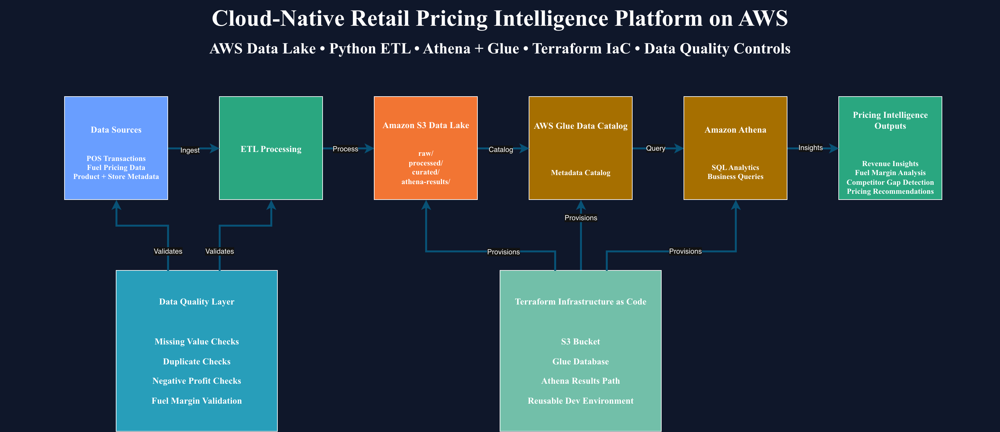

# Cloud-Native Retail Pricing Intelligence Platform on AWS

> End-to-end cloud data engineering project demonstrating pricing intelligence workflows using AWS, Python, SQL, and Terraform.

---

## Architecture



---

## Overview

This project demonstrates the design and implementation of a cloud-native retail pricing intelligence platform built on AWS.

The platform ingests multi-source retail and fuel pricing datasets, processes them through a modular ETL pipeline, stores them in a layered S3 data lake architecture, and generates analytical insights and pricing recommendations using serverless AWS analytics services.

The project models pricing intelligence workflows commonly used in distributed retail and fuel operations.

---

## Project Highlights

- Processed and analyzed **10,000+ simulated retail transactions** across multi-store environments
- Designed layered **Amazon S3 cloud-native data lake architecture**
- Built modular **Python ETL pipelines** for multi-source data integration
- Implemented **pricing recommendation logic** using margin and competitor analysis
- Developed **Athena-based analytical queries** for business insights
- Integrated **AWS Glue Data Catalog** for centralized metadata management
- Provisioned cloud infrastructure using **Terraform (Infrastructure as Code)**
- Implemented automated **data quality validation checks**

---

## Industry Relevance

Retail and fuel operations increasingly depend on cloud-native analytics systems to improve pricing visibility, operational consistency, and operational decision-making across distributed store networks.

This project demonstrates how scalable AWS-based data engineering pipelines can support pricing intelligence workflows by integrating transactional, product, and competitor pricing datasets into a centralized analytics platform.

---

## Operational Challenges

Multi-location retail and fuel businesses face several operational challenges:

- Maintaining competitive pricing across stores
- Monitoring fuel margin consistency by grade
- Identifying underperforming product categories
- Responding to competitor pricing changes
- Generating reliable operational insights from fragmented datasets

Without centralized analytics systems, pricing decisions are often reactive and operational visibility becomes limited.

---

## Technical Architecture

### Data Sources
- POS transaction datasets
- Fuel pricing datasets
- Product metadata
- Store metadata

### Data Lake Architecture (Amazon S3)
- `raw/` layer
- `processed/` layer
- `curated/` layer
- `athena-results/` layer

### Processing Layer
- Python ETL pipeline
- Pandas-based transformations
- Business rule processing
- Pricing recommendation logic

### Analytics Layer
- Amazon Athena
- SQL-based analytical queries

### Metadata Management
- AWS Glue Data Catalog

### Infrastructure Layer
- Terraform (Infrastructure as Code)

---

## Key Architecture Decisions

- Used Amazon S3 as a layered cloud-native data lake to separate raw, processed, and curated datasets
- Implemented modular ETL design to support scalable ingestion and future source expansion
- Selected Amazon Athena for serverless analytics to reduce operational overhead
- Used AWS Glue Data Catalog to centralize schema management for analytical querying
- Integrated Terraform to ensure reproducible infrastructure provisioning
- Added automated data quality validation checks to improve analytical reliability

---

## Data Pipeline Workflow

1. Raw retail and fuel datasets are ingested into Amazon S3 (`raw/`)
2. Python ETL pipelines clean, transform, and enrich the datasets
3. Processed datasets are stored in S3 (`processed/`)
4. AWS Glue catalogs datasets for query access
5. Amazon Athena performs SQL-based analytical querying
6. Pricing intelligence outputs and recommendations are generated

---

## Data Quality Controls

To improve reliability of analytical outputs, the platform includes:

- Missing value validation
- Duplicate record detection
- Negative gross profit validation
- Fuel margin consistency checks
- Automated quality reporting

The ETL pipeline generates a data quality report during execution.

---

## Analytics and Pricing Intelligence

The platform enables:

- Category-level revenue analysis
- Fuel margin analysis by grade
- Competitor price gap analysis
- Store-level pricing visibility
- Pricing recommendation generation based on business rules

### Example Analytical Outputs

- Top-performing product categories
- Average fuel margins by grade
- Competitor price comparison
- Margin-based pricing recommendations
- Store-level operational insights

---

## Scalability Considerations

The current implementation uses CSV-based batch ingestion for simulation purposes. The architecture was designed to support future enhancements including:

- Partitioned Parquet datasets
- Event-driven ingestion pipelines
- Real-time stream processing
- Large-scale analytical workloads
- BI dashboard integrations
- CI/CD automation workflows

---

## AWS Infrastructure (Terraform)

Infrastructure provisioning is managed using Terraform, including:

- Amazon S3 data lake buckets
- Structured storage layers
- Athena query results configuration
- AWS Glue database provisioning

Terraform enables reproducible and consistent infrastructure deployment across environments.

---

## Repository Structure

```text
data/
├── sample_raw/
├── sample_processed/

src/
├── etl/
├── analytics/
├── quality_checks/

terraform/
├── env/dev/
├── modules/

outputs/
├── reports/

diagrams/
├── Architecture.png
```

---

## Skills Demonstrated

- Cloud Data Engineering
- AWS S3
- AWS Athena
- AWS Glue
- Python ETL Development
- SQL Analytics
- Data Transformation
- Data Quality Validation
- Infrastructure as Code (Terraform)
- Cloud-Native Architecture Design

---

## Future Enhancements

- Real-time pricing ingestion pipelines
- Streaming analytics architecture
- Predictive pricing models
- Demand forecasting integration
- Dashboard integration using QuickSight or Power BI
- Automated CI/CD deployment pipelines

---

## Author

Narasimhulu Teja Boggu Narayanappa